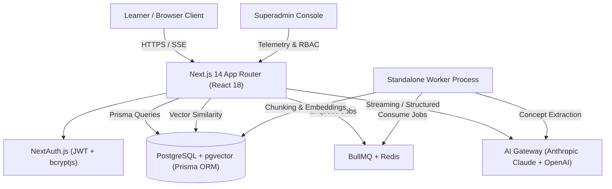

# System Architecture & Technical Design

## 1. High-Level Architecture Overview

The AI Study Companion is engineered as an integrated learning workspace that avoids fragmented AI wrappers by unifying user learning goals, multi-page document parsing, vector-grounded tutoring, deterministic assessment, dynamic concept mastery tracking, and background event orchestration.

---

## 2. Core Architectural Decisions & Trade-Offs

### 1. Monorepo with Standalone Asynchronous Worker
- **Decision**: Next.js App Router for web frontend and REST/SSE APIs; a separate Node/TypeScript process (`worker/index.ts`) consumes BullMQ queues.
- **Trade-off**: Requires running two processes in development (`npm run dev` and `npm run worker`), but isolates heavy PDF parsing, vector chunking, and batch embedding operations from Next.js serverless/HTTP request lifecycles, preventing request timeouts.

### 2. pgvector on PostgreSQL vs Dedicated Vector DB (Pinecone/Weaviate)
- **Decision**: Use `pgvector` on the same PostgreSQL database that holds relational data.
- **Trade-off**: Slightly higher query load on the primary DB, but guarantees ACID transactions, simplifies foreign key cascades (deleting a project cascades to chunks and masteries in one transaction), eliminates cross-service consistency bugs, and reduces infrastructure cost.

### 3. Streaming Server-Sent Events (SSE) for AI Tutor
- **Decision**: Stream LLM responses via HTTP SSE while tracking citations and saving the final message to Postgres upon stream completion.
- **Trade-off**: Requires careful SSE connection error handling in the client, but delivers immediate time-to-first-token (<800ms) for learner engagement.

### 4. Deterministic + Evaluative Quiz Grading
- **Decision**: Multiple-choice questions (MCQ) are strictly evaluated deterministically by comparing selected choice IDs against known correct IDs; open-ended questions use structured LLM evaluation with standardized rubrics (0–100 score, missing concept tags, constructive feedback).
- **Trade-off**: Two execution branches in the grading API, but provides deterministic fairness for factual queries while allowing nuanced qualitative grading for long-form reasoning.

### 5. Concept Mastery Mathematics
- **Decision**: Update concept scores with a 70/30 historical/performance weighting formula:
  $$\text{Mastery}_{\text{new}} = \text{clamp}_{0}^{100}\Big(\text{Mastery}_{\text{old}} \times 0.7 + \text{Score}_{\text{quiz}} \times 0.3\Big)$$
  with trend classifications (`IMPROVING`, `STABLE`, `NEEDS_ATTENTION`).
- **Trade-off**: Smoothed responsiveness prevents a single bad quiz from wiping out progress, while prioritizing concepts dipping below 40% for immediate review.

---

## 3. Data Flow & The Primary Learning Loop

1. **Space & Project Setup**: User creates a Space (subject container) and Project (concrete learning goal).
2. **Material Ingestion**: User uploads a PDF. File is stored, a `Material` record is created (`status = QUEUED`), and a `process-material` job is dispatched to BullMQ.
3. **Processing Pipeline**: Worker parses PDF pages, extracts text, generates sliding-window chunks (500 tokens with 50-token overlap), calls OpenAI `text-embedding-3-small`, persists 1536-dimensional vectors into Postgres, and calls Claude to extract key concepts. Material moves to `READY`.
4. **Retrieval & Tutor**: Learner queries the AI Tutor. The query is embedded, cosine similarity retrieves top-k relevant chunks scoped to the active project, evidence sufficiency is validated, and Claude streams a response with citation pills `[Material Name, Page X]`.
5. **Adaptive Quizzing**: The quiz engine selects concepts prioritized by low mastery and past errors, generates mixed MCQ and open-ended questions, deterministically/qualitatively grades them, and updates `ConceptMastery`.
6. **Mastery Recalculation & Recommendations**: The worker evaluates trends across the learner's history, detects repeated mistake patterns, and generates actionable next-step recommendations.
7. **Analytics**: Real-time project and global dashboards render mastery distributions, quiz trajectories, and telemetry.

---

## 4. What We Would Improve With More Time

1. **Hierarchical Multi-Document HyDE Retrieval**: Implement Hypothetical Document Embeddings and cross-encoder re-ranking (Cohere Rerank) for even sharper semantic search across 500+ page libraries.
2. **WebSockets for Real-Time Worker Status**: Replace polling with WebSocket push notifications for instant UI state transitions when documents finish processing.
3. **Flashcard Spaced Repetition (Anki/SM-2 Algorithm)**: Integrate scheduled interval review for long-term memory retention alongside adaptive quizzes.
